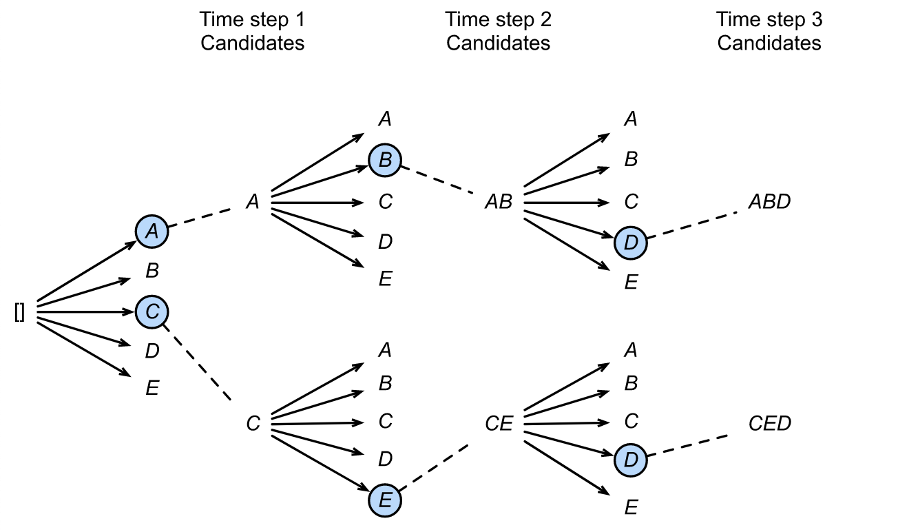
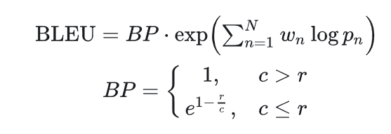
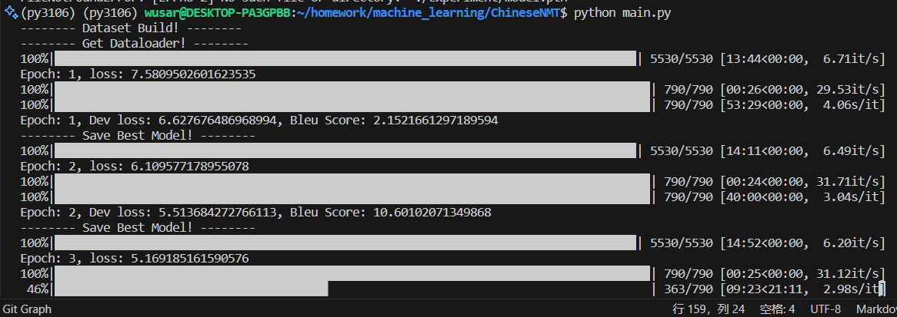
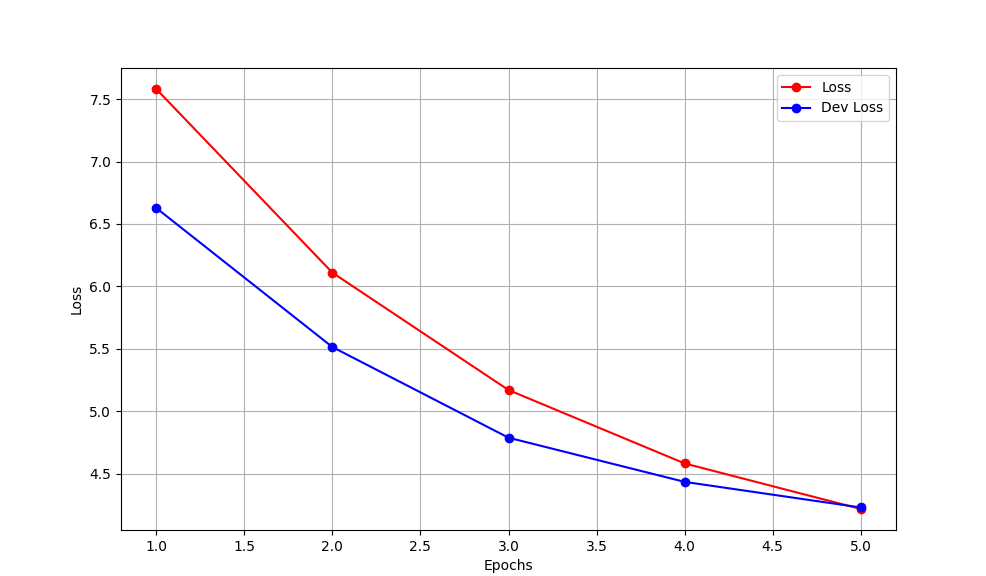
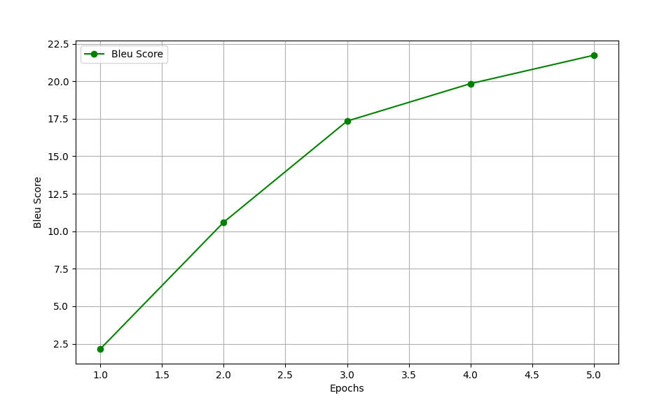
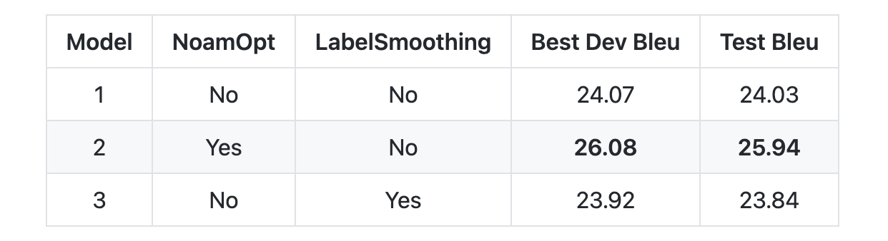
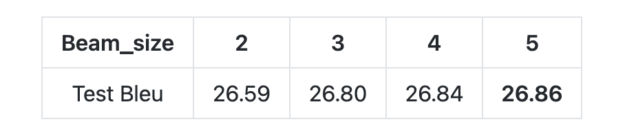

**深度学习实验五**

---

**实验题目：** 实现 `Transformer` 模型用于英译中机器翻译

**学号：** SA23229104

**姓名：** 吴立凡

**实验日期：** 2023 年 1 月 6 日

---

### 1. 实验目的

实现 `Transformer` 模型用于英译中机器翻译，模型中块的数量、模型维度甚至是数据规模可以自己调整以适应个人电脑。使用 `BLEU` 值作为评价指标。

### 2. 实验说明


本实验的代码fork自以下开源项目的实现
https://github.com/hemingkx/ChineseNMT

实验代码在
https://github.com/wusar/ChineseNMT
可以查看

本次实验follow知乎上面的教程：

[教你用PyTorch玩转Transformer英译中翻译模型！](https://zhuanlan.zhihu.com/p/347061440)

### 2.1 Beam Search

相比于分类任务，生成任务通常是一个时间步一个时间步依次获得，且之前时间步的结果影响下一个时间步，也即模型的输出都是基于历史生成结果的条件概率。在生成序列时，最暴力的方法当然是穷举所有可能的序列，选取其中连乘概率最大的候选序列，但该方法很明显计算复杂度过高。

一个自然的改进想法是，每一个时间步都取条件概率最大的输出，即所谓的贪心搜索（Greedy Search），但这种方法会丢弃绝大部分的可能解，仅关注当前时间步，无法保证最终得到的序列是最优解。集束搜索（Beam Search）实际是这两者的折中，简言之，在每一个时间步，不再仅保留当前概率最高的1个输出，而是每次都保留 num_beam 个输出。



### Bleu Score
BLEU即Bilingual Evaluation Understudy，在机器翻译任务中，BLEU非常常见，它主要用于评估模型生成句子（candidate）和实际句子（reference）之间的差异。其具体的计算公式见下式：



我们的BLEU值计算采用sacrebleu。sacrebleu指出，现有的BLEU计算工具(nltk等)均需要提前进行分词，采取的分词方案不同会导致BLEU计算的结果有较大差异。因此，sacrebleu接收原文本输入，将分词和bleu计算统一进行，提供了更加具有可比性的BLEU分数参考。

### 3 实验步骤

#### 3.1 训练分词器（tokenizer）

本项目使用sentencepiece实现BPE分词,我使用Back-translated news这个比较大的语料来训练分词器（下载地址为 https://data.statmt.org/wmt20/translation-task/back-translation/zh-en/）
在修改了tokenizer.py的数据路径后，运行以下命令来训练分词器：

```shell
cd tokenizer
python tokenizer.py
```

分词器的训练日志如下：

```shell
rainer_interface.cc(407) LOG(INFO) Loaded all 19763867 sentences
trainer_interface.cc(423) LOG(INFO) Adding meta_piece: <pad>
trainer_interface.cc(423) LOG(INFO) Adding meta_piece: <unk>
trainer_interface.cc(423) LOG(INFO) Adding meta_piece: <s>
trainer_interface.cc(423) LOG(INFO) Adding meta_piece: </s>
trainer_interface.cc(428) LOG(INFO) Normalizing sentences...
trainer_interface.cc(537) LOG(INFO) all chars count=723805732
trainer_interface.cc(548) LOG(INFO) Done: 99.95% characters are covered.
trainer_interface.cc(558) LOG(INFO) Alphabet size=3239
trainer_interface.cc(559) LOG(INFO) Final character coverage=0.9995
trainer_interface.cc(591) LOG(INFO) Done! preprocessed 19763867 sentences.
trainer_interface.cc(597) LOG(INFO) Tokenizing input sentences with whitespace: 19763867
trainer_interface.cc(608) LOG(INFO) Done! 20175515

```
训练完成后会在tokenizer文件夹下生成一些`eng.model`文件，这个文件就是我们训练好的分词器。


#### 3.2 导入训练翻译模型的数据库

根据实验要求，我下载了News Commentary v15 的数据集，下载地址为 https://data.statmt.org/news-commentary/v15/training/ ，下载其中的 en-zh pair，包含 320,712 条数据。划分其中的 80% 作为训练集，10% 作为验证集，10%作为测试集。

由于下载下来的数据集的格式是tsv格式，即每一行为一句话，中英文之间用制表符分隔。文件格式如下：
```
1929 or 1989?	1929年还是1989年?
PARIS – As the economic crisis deepens and widens, the world has been searching for historical analogies to help us understand what has been happening.	巴黎-随着经济危机不断加深和蔓延，整个世界一直在寻找历史上的类似事件希望有助于我们了解目前正在发生的情况。

```


但是，本项目的数据导入只支持json格式的文件，文件格式如下：

```
[["Some analysts argue that the negative effects of such an outcome would only last for \u201cmonths.\u201d", "\u67d0\u4e9b\u5206\u6790\u5bb6\u8ba4\u4e3a\u519b\u4e8b\u884c\u52a8\u7684\u8d1f\u9762\u6548\u679c\u53ea\u4f1a\u6301\u7eed\u77ed\u77ed\u201c\u51e0\u4e2a\u6708\u201d\u3002"], ["The Fed apparently could not stomach the sell-off in global financial markets in January and February, which was driven largely by concerns about further tightening.", "\u7f8e\u8054\u50a8\u663e\u7136\u65e0\u6cd5\u6d88\u53161\u6708\u548c2\u6708\u7684\u5168\u7403\u91d1\u878d\u5e02\u573a\u629b\u552e\uff0c\u800c\u8fd9\u4e00\u629b\u552e\u6f6e\u4e3b\u8981\u662f\u56e0\u4e3a\u5bf9\u7f8e\u8054\u50a8\u8fdb\u4e00\u6b65\u7d27\u7f29\u7684\u62c5\u5fe7\u5bfc\u81f4\u7684\u3002"]]

```
因此我修改了`data_loader.py`文件，使其支持导入tsv格式的文件。修改后的代码如下：

```python

def get_dataset(self, data_path, sort=False):
    """把中文和英文按照同样的顺序排序, 以英文句子长度排序的(句子下标)顺序为基准"""
    fp = open(data_path, encoding='utf-8')
    dataset = fp.readlines()
    out_en_sent = []
    out_cn_sent = []
    for idx, line in enumerate(dataset):
        en, cn = line.replace('\n', '').split('\t')
        # print(cn)
        out_en_sent.append(en)
        out_cn_sent.append(cn)
    
    if sort:
        sorted_index = self.len_argsort(out_en_sent)
        out_en_sent = [out_en_sent[i] for i in sorted_index]
        out_cn_sent = [out_cn_sent[i] for i in sorted_index]
    return out_en_sent, out_cn_sent

```


随后就可以运行以下命令来导入数据：

```shell
python main.py
```


#### 3.3 训练的实验结果

原始的训练日志如下：

```

-------- Dataset Build! --------
-------- Get Dataloader! --------
-------- Dataset Build! --------
-------- Get Dataloader! --------
100%|████████████████████████████████████████████████████████████████████████████████████| 5530/5530 [13:44<00:00,  6.71it/s]
Epoch: 1, loss: 7.5809502601623535
100%|██████████████████████████████████████████████████████████████████████████████████████| 790/790 [00:26<00:00, 29.53it/s]
100%|██████████████████████████████████████████████████████████████████████████████████████| 790/790 [53:29<00:00,  4.06s/it]
Epoch: 1, Dev loss: 6.627676486968994, Bleu Score: 2.1521661297189594
-------- Save Best Model! --------
100%|████████████████████████████████████████████████████████████████████████████████████| 5530/5530 [14:11<00:00,  6.49it/s]
Epoch: 2, loss: 6.109577178955078
100%|██████████████████████████████████████████████████████████████████████████████████████| 790/790 [00:24<00:00, 31.71it/s]
100%|██████████████████████████████████████████████████████████████████████████████████████| 790/790 [40:00<00:00,  3.04s/it]
Epoch: 2, Dev loss: 5.513684272766113, Bleu Score: 10.60102071349868
-------- Save Best Model! --------
100%|████████████████████████████████████████████████████████████████████████████████████| 5530/5530 [14:52<00:00,  6.20it/s]
Epoch: 3, loss: 5.169185161590576
100%|██████████████████████████████████████████████████████████████████████████████████████| 790/790 [00:25<00:00, 31.12it/s]
100%|██████████████████████████████████████████████████████████████████████████████████████| 790/790 [50:56<00:00,  3.87s/it]
Epoch: 3, Dev loss: 4.787280559539795, Bleu Score: 17.343057759963667
-------- Save Best Model! --------
100%|███████████████████████████████████████████████████████████████████████████████████████████████████████████████████████████████| 5530/5530 [12:55<00:00,  7.13it/s]
Epoch: 4, loss: 4.581043243408203
100%|█████████████████████████████████████████████████████████████████████████████████████████████████████████████████████████████████| 790/790 [00:23<00:00, 33.06it/s]
100%|█████████████████████████████████████████████████████████████████████████████████████████████████████████████████████████████████| 790/790 [44:46<00:00,  3.40s/it]
Epoch: 4, Dev loss: 4.433265686035156, Bleu Score: 19.84035773952465
-------- Save Best Model! --------
100%|███████████████████████████████████████████████████████████████████████████████████████████████████████████████████████████████| 5530/5530 [13:16<00:00,  6.94it/s]
Epoch: 5, loss: 4.21594762802124
100%|█████████████████████████████████████████████████████████████████████████████████████████████████████████████████████████████████| 790/790 [00:27<00:00, 28.49it/s]
100%|█████████████████████████████████████████████████████████████████████████████████████████████████████████████████████████████████| 790/790 [45:21<00:00,  3.44s/it]
Epoch: 5, Dev loss: 4.228055000305176, Bleu Score: 21.733959882420745
```


由于时间原因，我只训练了5个epoch，但是可以看到，模型在验证集上的Bleu Score已经达到了21.73，这个结果是非常不错的。

使用matplotlib绘制出训练的loss和Bleu score曲线如下：


```python

import matplotlib.pyplot as plt

# 提取的数据
epochs = [1, 2, 3, 4, 5]
loss = [7.5809502601623535, 6.109577178955078, 5.169185161590576, 4.581043243408203, 4.21594762802124]
dev_loss = [6.627676486968994, 5.513684272766113, 4.787280559539795, 4.433265686035156, 4.228055000305176]
bleu_score = [2.1521661297189594, 10.60102071349868, 17.343057759963667, 19.84035773952465, 21.733959882420745]

# 绘制loss曲线
plt.figure(figsize=(10, 6))
plt.plot(epochs, loss, marker='o', linestyle='-', color='r', label='Loss')
plt.plot(epochs, dev_loss, marker='o', linestyle='-', color='b', label='Dev Loss')
plt.xlabel('Epochs')
plt.ylabel('Loss')
plt.legend()
plt.grid()
plt.show()

# 绘制bleu score曲线
plt.figure(figsize=(10, 6))
plt.plot(epochs, bleu_score, marker='o', linestyle='-', color='g', label='Bleu Score')
plt.xlabel('Epochs')
plt.ylabel('Bleu Score')
plt.legend()
plt.grid()
plt.show()

```

loss和验证集上面的loss:



Bleu score:



### 测试集前50条翻译结果的对比

运行main.py后，输出的前50条翻译结果如下：

```

(py3106) wusar@DESKTOP-PA3GPBB:~/homework/machine_learning/ChineseNMT$ python main.py 
src: 1929 or 1989?
tgt: 1929年还是1989年?
translated: 1968年还是1989年?
-------------------
src: More unfortunate still was his implication that this was the cause of a series of gang rapes in Sydney in 2000, in which the attackers’ legal defense was that they thought the women were sexually available because they wore Western clothes.
tgt: 因为这些言论，他登上了澳大利亚各大报纸的头版头条。 更令人遗憾的是，他暗示是由于女人的不庄重导致了2000年悉尼的一系列群奸案件，这些案件的肇事者辩护说因为受害者穿着西方服饰，导致他们认为可以与之性交。
translated: 更不幸的仍然在于,这是2000年一系列强奸犯的原因,该事件发生在法军法属法律防御,因为他们认为女性是性,因为他们是西方广告。
-------------------
src: Their “technical” experts turned the country’s second city, Alexandria, into a Russian country club.
tgt: 苏联“技术”专家将埃及第二大城市亚历山大港变成了俄罗斯乡村俱乐部。
translated: 他们的“技术技术专家”将该国第二大城市布里斯岛进入俄罗斯俱乐部。
-------------------
src: Chile was thus “stabilized” by General Augusto Pinochet’s regime in the 1970s.
tgt: 智利就是这样在皮诺切特将军的政权下在20世纪70年代实现了“稳定 ” 。
translated: 因此,智利是20世纪70年代“稳定”。
-------------------
src: New member states should continue pursuing macroeconomic stability and financial discipline, particularly with respect to public finances.
tgt: 新晋成员国应该继续保持宏观经济的稳定性和金融规范，特别是在公共财政方面。
translated: 新成员国应该继续追求宏观经济稳定和金融纪律,特别是尊重公共债务。
-------------------
src: After lining up for an Association Agreement with the European Union, former Ukrainian President Viktor Yanukovych instead opted for closer ties with Russia, following immense pressure from the Kremlin, as well as a promise of $15 billion in financing.
tgt: 在排队等待与欧盟签订联合协议后，在克里姆林的巨大压力和150亿美元的巨资诱惑下，乌克兰前总统维克托·亚努科维奇反而选择了与俄罗斯拉近关系。
translated: 在与欧盟签订了联盟协议后,前乌克兰总统亚努科维奇选择与俄罗斯更紧密的关系,而克里姆林宫也是如此——以及150亿美元的融资承诺——后,乌克兰总统亚努科维奇又选择了紧密关系。
-------------------
src: Argentina destroyed its natural-gas sector with price controls.
tgt: 阿根廷通过价格控制破坏了了本国的天然气行业。
translated: 阿根廷摧毁其天然气部门的价格管制。
-------------------
src: With a clear target, their outrage acquires force and legitimacy.
tgt: 一旦有了明确的目标，他们的愤怒就会获得力量和合法性。
translated: 明确的目标是,他们的愤怒迫使帝国和合法性。
-------------------
src: The defining strength of traditional philanthropy is its ability to take risks.
tgt: 传统慈善的绝对优势是其承担风险的能力。
translated: 传统的慈善力量是其承担风险的能力。
-------------------
src: Even when parties seem to be carrying out a reasonable cost-benefit analysis of immigration’s economic impact, they tend to cite only the studies and data that back their own viewpoint.
tgt: 即使各方似乎正在对移民的经济影响进行合理的成本效益分析，他们也往往只引用研究和数据来支持自己的立场。
translated: 即使两党似乎采取了合理的成本分析移民对经济影响的影响,他们往往只是把他们的观点带上和数据。
-------------------
src: It would be ironic if China agreed to US demands to float the renminbi and the result was a depreciation that boosted its exporters' international competitiveness.
tgt: 如果中国同意美国的要求让人民币自由浮动，结果人民币出现有利于其出口商国际竞争力的贬值，这将十分讽刺。
translated: 如果中国同意放松人民币,结果将是促使其出口国国际竞争力贬值的贬值。
-------------------
src: This will require infrastructure development, as well as reliable systems for procuring supplies, maintaining equipment, and training and retaining personnel.
tgt: 不仅如此，及时准确地通过化验确诊结核病及其耐药状况的工作也必须得到加强。 这需要发展基础设施，建立供需品采购、设备维护和人员培训及使用的可靠系统。
translated: 这需要基础设施发展,以及可靠的系统限制供应、维持设备和训练人员。
-------------------
src: But if nobody knew how bad it was going to be, how could it have been communicated earlier?
tgt: 但既然没人知道它会变得多糟糕，他又怎么提前沟通这一点呢？
translated: 但如果没人知道这有多坏,又该怎么能?
-------------------
src: Israel is a specifically Jewish project, and to join the campaign of de-legitimization against the Jewish state is to join a campaign of de-legitimization against much of world Jewry, the vast majority of which either lives in Israel or regards it as a central component of Jewish identity.
tgt: 以色列是一个特殊的犹太项目，而加入一个试图将剥夺这个犹太国家合法性的运动就是加入了一个剥夺全世界大多数犹太人合法性的运动，因为这些人都居住在以色列，并将其视为犹太人身份定义的核心组成部分。
translated: 以色列是一个特别犹太项目,并加入了对犹太国家的反犹太国家运动。 以色列正在加入一场反犹太国家的运动,而多数是以色列,要么把以色列看作是犹太族人的主要组成部分。
-------------------
src: A few years ago, the World Values Survey questioned respondents in scores of countries about their attachments to their local communities, their nations, and to the world at large.
tgt: 几年前 ， “ 世界价值观调查”行动询问了数十个国家的民众对本地社区，国家和世界整体的情感依附状态。
translated: 几年前,世界价值观调查者质疑了来自本国社区、本国国家和世界问题的表现。
-------------------
src: The winner – the strategy most likely to produce a cooperative outcome – was Anatol Rapoport’s tit-for-tat (TFT) strategy.
tgt: 获胜者 — — 最有可能产生合作结果的策略 — — 是安纳托尔·拉波波特（Anatol Rapoport）的以牙还牙策略。
translated: 赢家——大部分可能是产生合作结果——是快速发展的扩散(TTF)战略。
-------------------
src: Will you support a comprehensive anti-corruption agenda, including closing down secret bank accounts?
tgt: 你是否会支持全面的反腐议程，包括封存秘密银行帐户？
translated: 你会支持全面的反腐败议程,包括关闭秘密的银行账户?
-------------------
src: This achievement contrasts starkly with all the critical voices that warned against the experiment of European Monetary Union and even predicted its early failure.
tgt: 这个成就与所有的曾经批评过欧洲货币联盟的声音，形成了鲜明的对照。 这种声音曾警告欧洲货币联盟所做的实验，甚至预期其早期就夭折。
translated: 这一成就与所有关键声音一致,警告说,反对货币联盟实验甚至预测其早期失败。
-------------------
src: When negotiating with Arab states, Israel was far more forthcoming than it ever was in the case of the Palestinian national movement.
tgt: 在与阿拉伯国家进行谈判时，以色列对巴勒斯坦民族运动的态度最为强硬。
translated: 当与阿拉伯国家展开谈判时,以色列比巴勒斯坦国家运动还要远。
-------------------
src: For example, the local real-estate boom and bust in Nevada was as severe as that in Spain or Ireland.
tgt: 比如，内华达州地方房地产业的枯荣循环与西班牙和爱尔兰一样猛烈。
translated: 比如,西班牙或爱尔兰一样,拥有地方房地产繁荣和衰退。
-------------------
src: So it seems that perceptions of trustworthiness in the Arab world are rooted, at least partly, in the uneven enforcement of commitments under Islamic law.
tgt: 如此看来，阿拉伯世界的诚信观至少部分来源于不平等的执行伊斯兰法规定的义务。
translated: 因此,阿拉伯世界对信誉的信任性认识似乎植根于伊斯兰法实施的承诺。
-------------------
src: A new federal crime bill, incorporating pay-for-success contracts, could encourage states to take a smarter approach to crime, reducing mandatory prison sentences and investing in effective anti-recidivism programs.
tgt: 包含成功后付酬合同的新联邦犯罪法可以鼓励各州对犯罪采取更明智的方针，降低强制刑期，投资于 有效的反再犯计划。
translated: 一个新的联邦犯罪法案可以引入偿付成功的合同,可以鼓励国家采取更聪明的方式,减少死刑,并投资有效的反保护主义计划。
-------------------
src: Crises of belief are manifestations of a chronic condition that must be managed.
tgt: 信仰危机一个是必须妥善管理的长期性状况的表征。
translated: 信念的危机表明必须管理长期条件。
-------------------
src: But in France, the majority says “no.” This deep pessimism militates against any public debate or reform, and exaggerates the importance of the current political crisis.
tgt: 法国人对市场经济的欢迎程度不如其他欧美国家，甚至还不如俄罗斯和中国。
translated: 但在法国,大部分人认为“不”,这一深刻悲观主义对任何公众辩论或改革都产生了怀疑,并夸大当前的政治危机的重要性。
-------------------
src: But seldom will it be the case that the best response is simply to walk away.
tgt: 但是，视而不见很少就是最佳的对应之策。
translated: 但很少能确定最好的应对措施。
-------------------
src: German Chancellor Angela Merkel is now in a bind.
tgt: 德国总理默克尔现在陷入了两难。
translated: 如今,德国总理默克尔已经陷入了困境。
-------------------
src: This will be more difficult for the far left, at least in France, which combines traditionally liberal views on immigration with protectionist economic policies that look at lot like those espoused by the populist right.
tgt: 对于极左翼来说则更加困难，至少在法国是如此，因为他们得将对移民的传统自由主义观点与贸易保护主义经济政策结合在一起，而第二项政策看起来跟民粹主义右派所拥护的并无二致。
translated: 这将会比法国更困难,至少在法国是如此,而法国则将传统上对移民保护主义的经济政策视为民粹主义右翼人士。
-------------------
src: Zionism has lost its way as a defining paradigm for a nation willing to find a bridge with the surrounding Arab world.
tgt: 犹太复国主义已不再是定义愿意与周边阿拉伯世界寻找联系的民族的范式。
translated: 犹太复国主义已经失去了其作为国家愿意与阿拉伯世界接触的桥梁。
-------------------
src: A third significant accomplishment of Obama’s first year has been to reframe the issue of nuclear non-proliferation, which many experts regarded as being in crisis at the end of the Bush era.
tgt: 奥巴马第三个重要贡献就在于，重新构造了核不扩散问题，很多专家都认为，这个问题在布什政府的后期已经相当危险。
translated: 奥巴马第一年第一项重大成就让核不扩散问题感到困惑,因为很多专家都被认为是布什时代的终结。
-------------------
src: How do you convince your passionate followers if other, equally credentialed, economists take the opposite view?
tgt: 如果和你一样分量的经济学家与你观点相左，你如何说服你的狂热追随者？
translated: 你如何说服你的热情追随者,如果其他话话,经济学家又怎么提出相反的观点?
-------------------
src: Can they, and other Americans who are losing vital services, really be expected to rise above it all and support funding to build new schools in Afghanistan?
tgt: 他们（以及其他正在失去生活必须服务的美国人）真的会期待付出更多的税收来为阿富汗建设新学校提供资金？
translated: 他们能否失去关键服务的美国人是否可以期待增加所有和支持在阿富汗建立一个新学校的新学校?
-------------------
src: A Better Way from ‘R’ to ‘D’
tgt: 从‘研究’到‘开发’的更好方法
translated: “研发”更好的方法
-------------------
src: Microfinance – its advent, rise, and recent crises – shows how.
tgt: 小额信贷 — — 它的产生、崛起以及最近的危机 — — 向我们展示了具体的过程。
translated: 微型金融机构——它的动作、崛起和最近的危机——表明会发生什么。
-------------------
src: By denying his wish, AKP parliamentarians would weaken Erdoğan’s standing, possibly enabling the party to push him aside.
tgt: AKP议员可以通过否决埃尔多安的这一意图削弱埃尔多安的地位，使AKP有可能将他甩掉。
translated: 正义与发展党拒绝他的愿望,AKP议员将削弱埃尔多安的地位,从而促使其下台。
-------------------
src: Though Trump’s appearance indicates that the US political system has also deteriorated markedly, the Democrats still favor policies like wage insurance and universal health insurance, and the Republicans still oppose them.
tgt: 尽管特朗普的出现表明美国政治制度也遭到了严重的扭曲，但民主党仍然支持工资保险和全民医疗保险等政策，而共和党依然反对这些政策。
translated: 尽管特朗普的景象表明,美国政治制度也急剧恶化,但民主党仍然喜欢如工资保险和整体保险,而共和党仍然反对他们。
-------------------
src: This psychological backdrop to the bilateral relationship truly is worse than during the Cold War.
tgt: 这一双边关系的心理背景确实比冷战期间更加糟糕。
translated: 这一双边关系的心理背景比冷战时代更加糟糕的。
-------------------
src: Putin’s extravagant vanity has severely undermined the strongman image that he has spent the last 12 years building.
tgt: 普京极大的虚荣心严重破坏了其在过去12年树立起来的强人形象。
translated: 普京的肮脏行为严重削弱了他过去12年来所收集的强势形象。
-------------------
src: Throughout these discussions, the line between asylum seekers and economic migrants, who are not protected by binding international humanitarian conventions, has been blurred.
tgt: 这些讨论模糊了庇护寻求者和不受国际人道主义公约保护的经济移民之间的界限。
translated: 在这些讨论中,寻求庇护者和经济移民之间的界限——那些不受到国际人道主义公约的保护——已经模糊了。
-------------------
src: These facilities and networks – along with the broadband networks on which telecommunications companies spend billions – form the foundations of the Internet.
tgt: 这些设施和网络 — — 以及通信公司花数十亿美元建设的宽带网络 — — 构成了互联网的基础。
translated: 这些设施和网络——与通信公司花数千亿美元——构成了互联网基础的基础。
-------------------
src: In the face of an immense tragedy, working class families around the world opened their wallets to the disaster’s victims.
tgt: 大灾面前，全世界的工薪家庭都打开钱袋，援助受灾群众。
translated: 在面对一场可怕的悲剧中,全世界都有劳动阶层为这场灾难受害者开放。
-------------------
src: The other prong, promoting the rule of law, international cooperation, and the principles of open society has to be pursued indirectly, by reforming the international financial system and by paying special attention to Russia’s near-abroad.
tgt: 另一个刀刃，也就是促进民主、国际合作以及开放社会的原则应当通过改革国际金融体系以及特别关注俄国近邻而间接地予以追寻。
translated: 其他审慎、促进国际法、国际合作以及开放社会的原则已经严格实施,改革国际金融体系,并给予俄罗斯近线基本关注。
-------------------
src: Venezuela, with some of the world’s largest hydrocarbon reserves, should be enjoying an era of prosperity amid high oil prices.
tgt: 委内瑞拉拥有全球最大碳氢化合物储量之一，在高油价时代本应进入繁荣。
translated: 委内瑞拉,由于世界上某些最大的水电储量,也应该在油价高企时享受繁荣时代。
-------------------
src: And the quality of education and the formation of human capital could benefit from less rigid allocation of public resources and more experience-sharing among states and municipalities, some of which have made progress using measures that could be applied elsewhere.
tgt: 此外，提高公共资源的灵活性以及各州、市之间更多的经验分享有利于提高教育质量以及人力资本的形成。 一些州和市的成功经验可以应用到其他地区。
translated: 而教育与人力资本相结合的质量可能有利于减少公共资源分配和市政之间的联系,一些用于使用其他措施。
-------------------
src: We knew that the risks we ran of being roughed up or arrested while demonstrating against visiting Springbok rugby teams were entirely trivial compared to the risks that he and his colleagues had been prepared to face.
tgt: 我们知道比起他和他的同事承担的风险，我们在向来访的跳羚橄榄球队示威时所冒的被打和被捕的风险其实微不足道。
translated: 我们知道,在我们被打碎或逮捕的之春队时,我们完全不顾他及其同事准备面对的风险。
-------------------
src: Last year, the World Economic Forum launched a program called Internet For All.
tgt: 去年，世界经济论坛发起了一个称为“有网无类 ” （ Internet For All）的计划。
translated: 去年,世界经济论坛发起了一个“互联网所有”项目。
-------------------
src: That has been a very effective incentive for the purchase of private insurance in the United States and Britain.
tgt: 在美国和英国，这都是非常有效的购买私人保险的激励。
translated: 这是美国和英国购买私人保险的一种有效的激励。
-------------------
src: As one Albanian leader saw it, Macedonians were merely “Slavic clones.”
tgt: 在某位阿尔巴尼亚领导人眼中，马其顿人只不过是一些“斯拉夫种 ” 。
translated: 正如一位阿尔巴尼亚领导人所看到的那样,马戏团只是“叛乱”。
-------------------
src: Any disagreement with a government’s immigration policy, for example, might eventually be deemed “racist,” resulting in curtailment of freedom of speech.
tgt: 任何（比如）对政府移民政策的不满最终都有可能被认为是“种族主义 ” ， 从而导致言论自由的萎缩。
translated: 比如,任何政府移民政策的分歧都会最终被认为是“种族主义”,从而限制言论自由。
-------------------
src: What is the cause of this seeming paradox?
tgt: 这个看上去有些自相矛盾的事情的原委是什么呢？
translated: 这一悖论究竟会是什么?
-------------------
src: There is one more crucial dynamic that will shape how the global economy will develop in the coming decades: the strategic rivalry between China and the US.
tgt: 还有一种关键力量将决定未来数十年全球经济将如何发展：那就是中美之间的战略竞争。
translated: 未来数十年里,全球经济如何发展:中国和美国的战略对立。
-------------------
100%|████████████████████████████████████████████████████████████████████████████████████████████████████████| 502/502 [01:00<00:00,  8.33it/s]
100%|████████████████████████████████████████████████████████████████████████████████████████████████████████| 502/502 [29:22<00:00,  3.51s/it]
```

### 一些后续的讨论与消融实验

如上所述，我们具体探究了NoamOpt, Label Smoothing对英译中任务的提升效果。实验结果如表所示：



从表中可以看到，NoamOpt对实验效果的提升较大，在验证集上的最优Bleu分数提升了8.4%，测试集Bleu分数提升了7.9%。在本实验中，我们设置Label Smoothing的比例为0.1，其对实验效果的提升并不明显。但在之后基于fairseq的实验中，我们发现Label Smoothing确实对BLEU分数有一定的提升效果。

我们实现了Beam Search并在测试集上探究了不同beam size的bleu结果，如表所示。



可以看到，随着beam size增加，BLEU值也明显增加，且显著优于greedy decode的BLEU分数，提升3.5%。

本次实验我实现了一个Transformer模型用于英译中机器翻译。使用BLEU值作为评价指标,并且使用了Beam Search来生成翻译结果。实验结果表明，模型在训练集上的BLEU值达到了21.73。

